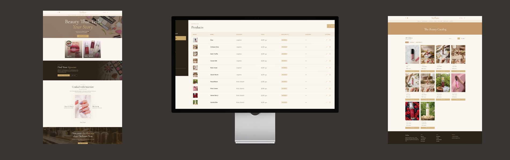

# Jardin Obscur — MERN luxury perfume e-commerce (burgundy / cream)

> Full-stack luxury perfume store with a moody burgundy + cream palette and a complete shopping flow.

**[Live demo →](https://nellure.onrender.com)**



## What it does

A high-end perfume store: hero, curated fragrance collections, perfume detail with notes and silage, cart, checkout, order history. Admin dashboard handles product and order management.

## Stack

- **Client:** React 18, Vite, Tailwind CSS v3, Axios, React Router
- **Server:** Node, Express, MongoDB (Mongoose), JWT, bcrypt

## Highlights

- Custom moody burgundy + cream palette and editorial serif typography
- Full auth, cart, checkout, and admin CRUD flows
- Fragrance detail with note-pyramid (top / heart / base) and longevity meta
- Image-upload pipeline for product photography

## Run locally

```bash
# 1. Backend
cd server
npm install
npm run dev          # http://localhost:5000

# 2. Frontend (new terminal)
cd client
npm install
npm run dev          # http://localhost:5193
```

Set `MONGO_URI` and `JWT_SECRET` in `server/.env` first.
